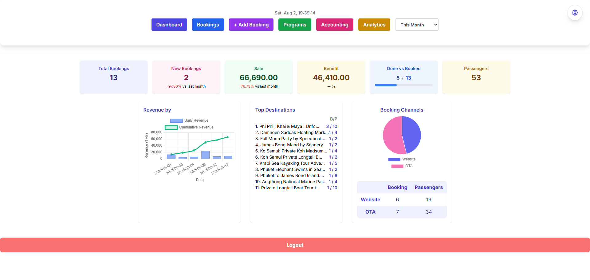

# Bookings Management & Notification Dashboard

A modern Node.js + PostgreSQL (Neon) system for automated bookings management, email parsing, and real-time notifications. Features a secure, role-based static HTML/JS dashboard for operations, accounting, and program management. All configuration is managed via the dashboard and stored in the database.

---

## 🚀 Features

- **Automated Email Parsing:**
  Extracts bookings from Bokun.io and Thailand Tours emails with robust parser rules.
- **Multi-Channel Notifications:**
  Sends booking notifications via Email, Telegram, and LINE. Telegram notifications are sent for bookings made for today (Bangkok time).
- **Interactive Bookings Management:**
  - Rate dropdowns in bookings table allow quick rate changes without editing entire booking
  - Real-time rate updates with automatic table refresh and calculations
  - Smart dropdown population based on available rates for each SKU
- **Modern Dashboard:**
  - Card-style settings modal with colorful buttons, toggles, and responsive design
  - Summary cards for Total Bookings, New Bookings, and Benefit
  - Booking channels breakdown with PieChart and filter-on-click
  - Top Destinations with expandable list
  - Interactive rate dropdowns in bookings table for easy rate changes
  - Advanced analytics with average sales and benefits per channel
  - Responsive, modern UI with theme colors
  - Secure login-protected access
- **Role-Based Access Control:**
  Four user roles with granular permissions (see below).
- **Database-Driven Settings:**
  All notification and sensitive settings (Telegram Bot Token, Chat ID, notification email, etc.) are managed via the dashboard UI and stored in the database. No .env for notification targets.
- **Advanced Analytics:**
  - Real-time calculation of average sales and benefits per channel
  - Enhanced analytics grid with 4 new average metrics
  - Channel performance insights with per-booking averages
- **Schema Compatibility:**
  Graceful handling of different database schemas across deployments with automatic column existence checks.

---

## 📸 Screenshots

> **Tip:** Place your screenshots in `public/screenshots/` and reference them below.

### Dashboard


### Settings Modal


### Mobile Responsive


---

## ⚡ Quickstart

1. **Clone the repository:**
   ```sh
   git clone <your-repo-url>
   cd <project-folder>
   ```
2. **Install dependencies:**
   ```sh
   npm install
   ```
3. **Set up the database:**
   - Create a Neon (or standard Postgres) database.
   - Run the schema in `db_sample.sql`:
     ```sh
     psql <your-connection-string> -f db_sample.sql
     ```
4. **Run the server:**
   ```sh
   npm start
   ```
5. **Access the dashboard:**
   - Open `public/index.html` in your browser (or deploy via static hosting).
   - Log in with your Google account (must be whitelisted).

---

## 🗄️ Database Migrations

### Adding Missing Columns

If you encounter errors related to missing columns, run the following SQL in your Neon SQL Editor:

```sql
-- Add national_park_fee column for National Park Fee feature
ALTER TABLE bookings
ADD COLUMN IF NOT EXISTS national_park_fee BOOLEAN DEFAULT FALSE;

-- Add google_analytics_id column for Google Analytics tracking
ALTER TABLE settings 
ADD COLUMN IF NOT EXISTS google_analytics_id TEXT;
```

### Schema Compatibility

The application automatically handles missing columns and provides user-friendly error messages when features are not available in your database schema. This ensures compatibility across different deployments with varying database configurations.

---

## 👤 User Roles & Permissions

- **Admin:** Full access to all features and settings
- **Accounting:** Access to accounting and reporting features
- **Programs Manager:** Manage programs and rates
- **Reservation:** Manage bookings and notifications

---

## 🛠️ Development
- All configuration is managed via the dashboard and stored in the database.
- For customizations, edit the HTML/CSS/JS in the `public/` folder.
- For backend logic, see the `api/` folder.

---

## 📬 Contact
For support or questions, open an issue or contact the maintainer. 